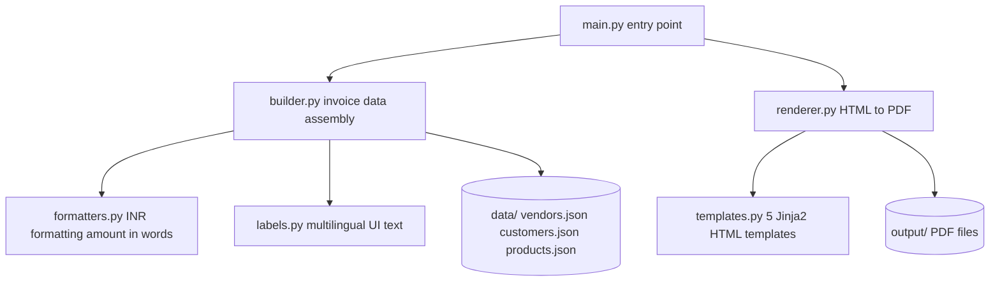

# Invoice Generator

A production-ready, multilingual GST-compliant invoice generator for Indian businesses.
Generates realistic PDF invoices in **7 Indian languages** across **5 professional visual templates** — ideal for dataset generation, testing, demos, and portfolio projects.

---

## Features

- **7 languages** — English, Hindi, Marathi, Kannada, Bengali, Tamil, Telugu
- **5 visual themes** — Blue Corporate, Emerald Green, Saffron Indian, Dark Executive, Maroon Classic
- **GST-compliant** — CGST+SGST (intra-state) and IGST (inter-state) calculations
- **Realistic data** — randomised vendors, customers, products, invoice numbers, and dates
- **Dual PDF backends** — WeasyPrint (primary), headless Edge/Chrome (fallback)
- **Indian number formatting** — 1,23,456.78 grouping and amount-in-words (up to Crores)
- **Simple CLI** — filter by language, template, count, and output directory

---

## Architecture



**Flow:** `main.py` parses arguments -> `builder` randomly assembles invoice data from JSON fixtures -> `renderer` injects data into a Jinja2 HTML template -> WeasyPrint or headless Edge/Chrome converts to PDF.

---

## Tech Stack

| Layer             | Technology                                  |
|-------------------|---------------------------------------------|
| Templating        | Jinja2                                      |
| PDF generation    | WeasyPrint + pydyf (primary)                |
| PDF fallback      | Microsoft Edge / Google Chrome headless     |
| Typography        | Google Fonts — Noto Sans family (7 scripts) |
| Data              | JSON fixtures (vendors, customers, products)|
| CLI               | Python argparse                             |
| Package manager   | [uv](https://github.com/astral-sh/uv)       |

---

## Folder Structure

```
invoice_generator_code/
|
+-- main.py                  # Entry point — run this
+-- builder.py               # Invoice data assembly + JSON loading
+-- renderer.py              # Jinja2 HTML rendering + PDF conversion
+-- formatters.py            # INR formatting, amount-in-words
+-- labels.py                # UI text strings for all 7 languages
+-- templates.py             # 5 Jinja2 HTML/CSS invoice templates
|
+-- data/                    # JSON fixture files (seed data)
|   +-- vendors.json         # 5 vendors x 7 languages
|   +-- customers.json       # 6 customers x 7 languages
|   +-- products.json        # 12 products x 7 languages
|
+-- scripts/
|   +-- clean_output.py      # Deletes intermediate .html files
|
+-- output/                  # Generated files (git-ignored)
|
+-- .gitignore
+-- .python-version
+-- pyproject.toml
+-- requirements.txt
+-- uv.lock
```

---

## Installation

### Prerequisites

- Python 3.12+
- [uv](https://github.com/astral-sh/uv) (recommended) **or** pip

### With uv (recommended)

```bash
git clone <repo-url>
cd invoice_generator_code

uv sync
```

### With pip

```bash
git clone <repo-url>
cd invoice_generator_code

python -m venv .venv
source .venv/bin/activate     # Windows: .venv\Scripts\activate

pip install -r requirements.txt
```

> **Note on WeasyPrint (Windows):** WeasyPrint requires GTK3 libraries.
> Install the [MSYS2 GTK3 runtime](https://www.msys2.org/) or rely on the
> automatic headless Edge/Chrome fallback — no extra setup needed.

---

## Running

```bash
# Generate 5 invoices per language across all 7 languages (default)
python main.py

# Generate 3 Hindi invoices
python main.py --count 3 --lang hi

# Generate 10 invoices in all languages using the Emerald Green template
python main.py --count 10 --lang all --template 2

# Save to a custom directory
python main.py --output ./my_invoices
```

### CLI Reference

| Argument     | Default    | Description                                  |
|--------------|------------|----------------------------------------------|
| `--count`    | `5`        | Number of invoices per language              |
| `--lang`     | `all`      | Language code or `all`                       |
| `--template` | `0`        | Template 1-5, or `0` for random per invoice  |
| `--output`   | `output/`  | Output folder (created next to main.py)      |

### Supported Languages

| Code | Language | Script      |
|------|----------|-------------|
| `en` | English  | Latin       |
| `hi` | Hindi    | Devanagari  |
| `mr` | Marathi  | Devanagari  |
| `kn` | Kannada  | Kannada     |
| `bn` | Bengali  | Bengali     |
| `ta` | Tamil    | Tamil       |
| `te` | Telugu   | Telugu      |

### Visual Templates

| # | Name            | Primary Color      |
|---|-----------------|--------------------|
| 1 | Blue Corporate  | Navy `#1a5276`     |
| 2 | Emerald Green   | Forest `#1e8449`   |
| 3 | Saffron Indian  | Saffron `#e67e22`  |
| 4 | Dark Executive  | Charcoal `#1c2833` |
| 5 | Maroon Classic  | Maroon `#7b241c`   |

---

## Workflow Explanation

```
1. main.py parses --count / --lang / --template / --output arguments

2. builder.load_data() reads three JSON fixture files:
   - vendors.json   -> 5 companies per language (name, address, GSTIN, PAN, bank)
   - customers.json -> 6 buyers per language (name, address, GSTIN)
   - products.json  -> 12 items per language (description, HSN code, unit, price)

3. For each invoice:
   a. Random vendor, customer, and 2-5 products are selected
   b. Quantities (1-8) and +/-10% price variation are applied
   c. GST type is chosen: CGST+SGST (intra-state) or IGST (inter-state)
   d. Invoice date (up to 30 days ago) and due date (+15/30/45/60 days) are set
   e. Invoice number is generated in one of 5 realistic Indian formats

4. renderer.render_and_save():
   a. Injects invoice data into the Jinja2 HTML template
   b. Saves rendered HTML to the output directory
   c. Converts to PDF via WeasyPrint; falls back to headless Edge/Chrome
   d. Returns True if PDF was produced, False if HTML-only
```

---

## GST Compliance Details

| Field           | Detail                                              |
|-----------------|-----------------------------------------------------|
| Vendor GSTIN    | State code + PAN-based format (e.g. 27AAAFN9012C1ZX)|
| Customer GSTIN  | Buyer's tax registration number                     |
| HSN Codes       | 8-digit Harmonised System Nomenclature per line item|
| Intra-state tax | CGST 9% + SGST 9%                                   |
| Inter-state tax | IGST 18%                                            |
| PAN             | Permanent Account Number of the seller              |
| Amount in words | English, up to Crores                               |

---

## Example Console Output

```
PDF engine : weasyprint
Languages  : en, hi, mr, kn, bn, ta, te
Count      : 3 per language
Output     : .../invoice_generator_code/output

  [PDF]  sample_1_english.pdf  (T1: Blue Corporate)
  [PDF]  sample_2_english.pdf  (T3: Saffron Indian)
  [PDF]  sample_3_english.pdf  (T5: Maroon Classic)
  [PDF]  sample_1_hindi.pdf    (T2: Emerald Green)
  ...

Done.  PDF: 21  HTML: 0  -> .../invoice_generator_code/output
```

---

## Cleaning Up HTML Files

```bash
python scripts/clean_output.py

# Target a specific folder
python scripts/clean_output.py output
```

---

## Troubleshooting

**WeasyPrint fails to install on Windows**
WeasyPrint requires native GTK3 libraries. Install [MSYS2 + GTK3](https://www.msys2.org/), or skip it — the headless browser fallback is automatic.

**Only HTML generated, no PDF**
The generator prints `[HTML]` when no PDF backend is available. Either install WeasyPrint with GTK3, or ensure Microsoft Edge or Google Chrome is installed.

**Characters appear as boxes**
Non-Latin scripts use the Noto Sans font family loaded from Google Fonts. Ensure internet access on first run.

**Unicode errors in Windows terminal**

```bash
set PYTHONIOENCODING=utf-8
python main.py
```

---

## Contribution Guidelines

1. Fork the repository and create a feature branch.
2. Keep templates in `templates.py` and UI text in `labels.py`.
3. Verify with `python main.py --lang all --count 2` before submitting.
4. Open a pull request with a clear description of the change.

---

## License

MIT — free to use, modify, and distribute.
